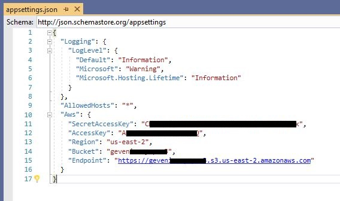

Create AWS S3 Bucket
====================

Log in to aws with your account and go [console.aws.amazon.com/iam](https://console.aws.amazon.com/iam) and create ```access-key-ID``` and ```secret-access-key```  from "Your Security Credentials > Access keys (access key ID and secret access key)"

Method 1 as serverless
-----------------------

Download  [Nodejs](https://nodejs.org/) and install

Go [...\s3-bucket\serverless.yml](serverless.yml) file in project (all s3 bucket settings and permissions on ```serverless.yml``` )

Set  ```BucketName: ***your-unique-bucket-name*** ```
 
Go in project ```...\s3-bucket``` path open on CLI and run commands:

```sh
...\s3-bucket_> npm install -g serverless
```

```sh
...\s3-bucket_> serverless config credentials --provider aws --key "**access-key**" --secret "**secret-access-key**" --profile serverless-admin
```

```sh
...\s3-bucket_> serverless deploy
```

Method 2 on [console.aws.amazon.com](https://console.aws.amazon.com) panel
-----------------------

Create s3 bucket and configure permissions on [console.aws.amazon.com](https://console.aws.amazon.com)

[How Do I Create an S3 Bucket? Aws guide ](https://docs.aws.amazon.com/AmazonS3/latest/user-guide/create-bucket.html)


Configuretion in ```appsettings.json```
-----------------------------------------

set aws keys on ```appsettings.json``` 

```json
{
  ....
  "Aws": {
    "SecretAccessKey": "**secret-access-key**",
    "AccessKey": "**access-key**",
    "Region": "**your-region**",//my region 'us-east-2'
    "Bucket": "***your-unique-bucket-name***",
    "Endpoint": "https://{**your-unique-bucket-name**}.s3.{**your-region**}.amazonaws.com"
  }
}
```

